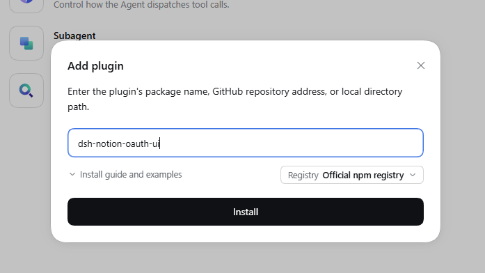
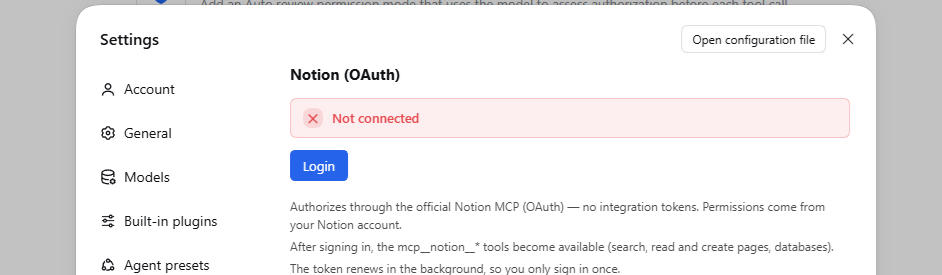
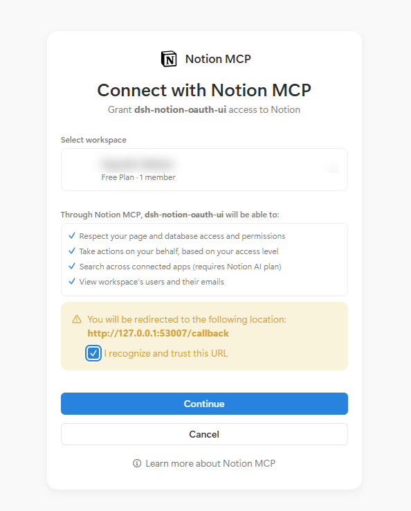
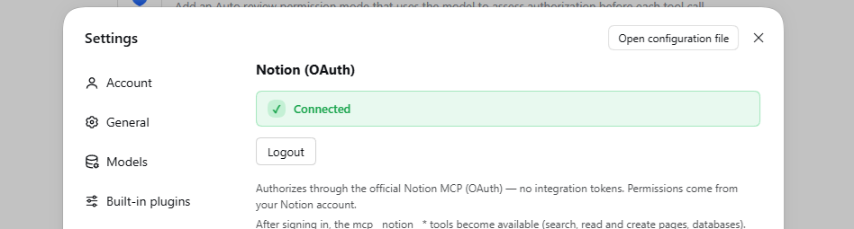

# dsh-notion-oauth-ui

Connect Notion from the [DeepSeek Harness](https://github.com/deepseek-ai/deepseek-harness) GUI with OAuth 2.0 (authorization code + PKCE) — no Integration Token to copy, and no terminal required. Pages, databases and comments are reached through the official Notion MCP server.

## Features

- **GUI login** — a "Notion" page under Settings with a one-click Login (no terminal, no Integration Token).
- **CLI fallback** — `dsh notion login` for headless / CLI profiles.
- **OAuth + PKCE** — dynamic client registration (RFC 7591), no `client_id`/secret to copy.
- **Silent refresh** — access token refreshed automatically; refresh token rotated atomically.
- **Tools as `mcp__notion__*`** — search, read/create pages, databases, comments via the official MCP server.

## Setup

**1. Install** — Settings → Plugins → **Add plugin** → `dsh-notion-oauth-ui` → **Install**.



**2. Sign in** — Settings → **Notion** → **Login**.



**3. Approve** — your browser opens Notion: pick a workspace and press **Continue**.



**4. Done** — the page switches to **Connected**, and the `mcp__notion__*` tools become available.



On a headless or CLI-only profile the same flow runs from the terminal:

```sh
dsh plugin --profile <name> add dsh-notion-oauth-ui
dsh notion login
```

## Config

| Key | Default | Meaning |
|---|---|---|
| `mcpUrl` | `https://mcp.notion.com/mcp` | Notion MCP server URL |
| `port` | `53007` | Local OAuth callback port (`127.0.0.1`) |
| `refreshLeadMs` | `300000` (5 min) | Refresh the token this far before it expires |
| `refreshRetryMs` | `60000` (1 min) | Retry interval when a refresh attempt fails |

## Security

- **Loopback-only control routes.** The Settings page talks to
  `/api/dsh-notion-oauth-ui/{status,login,logout}`. Each route is pinned to one HTTP
  method (`GET /status`, `POST /login`, `POST /logout`) and accepts only requests
  whose remote address and `Host` are loopback and that are not `Sec-Fetch-Site:
  cross-site`. When an `Origin` is present it must be the app itself
  (`dsh-app://app`) or the same host. The Desktop shell proxies renderer calls and
  strips `Origin`/`Sec-Fetch-Site`, so an absent `Origin` is normal; the two POST
  routes therefore additionally require `Content-Type: application/json` — not a
  CORS-simple value, so a cross-site caller first needs a preflight that these
  routes reject.
- **OAuth hardening.** Authorization code + PKCE (S256), a per-flow `state` the
  callback server verifies, and a 10-minute deadline on the callback. A malformed
  or forged callback is answered with 400 and leaves the pending login running,
  so a stray local request cannot kill a real authorization.
- **Transport.** `mcpUrl` must be `https://` — the plugin refuses to load
  otherwise. Discovery endpoints (authorization, token, registration) are read
  from whatever the `mcpUrl` resource advertises, so keep it on a trusted origin.
- **Token at rest.** The access/refresh token is stored as a single record in the
  DSH credentials service (`NOTION_OAUTH`). That store is only as private as your
  OS user account: tool processes run as the same user, so any plugin with
  credentials access can read every stored secret (`NOTION_OAUTH`,
  `DEEPSEEK_API_KEY`, …), not just its own. The token is never exposed to the
  browser half, never returned by an HTTP route, and never written to logs.

## Development

```sh
pnpm install      # installs dev dependencies and builds lib/ via the prepare hook
pnpm run build    # rebuilds lib/index.js (host) and lib/client.js (browser half)
```

`lib/` is build output and is not committed; `pnpm install` and `pnpm pack`
regenerate it through the `prepare` script.

`pnpm run typecheck` checks the sources against the DSH host packages
(`@deepseek-ai/*`). DeepSeek Harness provides those at runtime, and their npm
publication is currently incomplete — some transitive packages are missing from
the registry — so typechecking needs an environment that supplies them. The
build itself has no such dependency.

## License

MIT. Reuses code/patterns from `dsh-notion-mcp` and `dsh-notion-connector` (both MIT).
