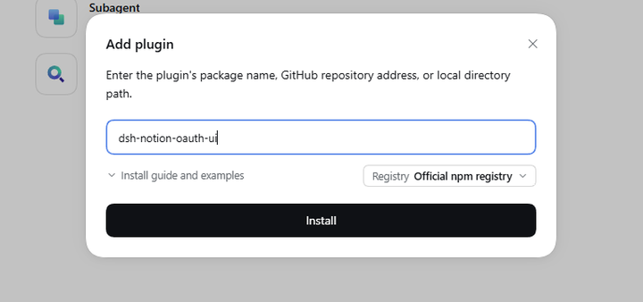
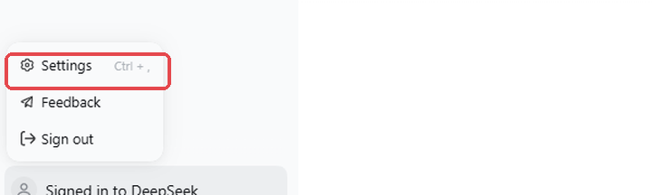
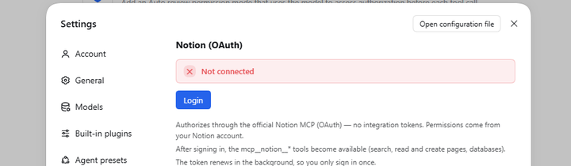
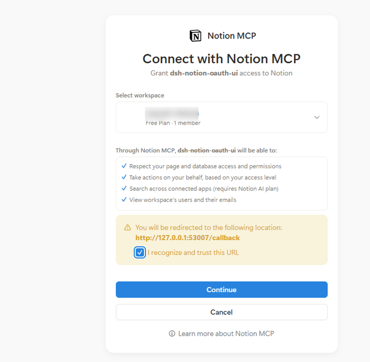
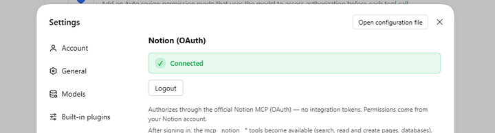

# dsh-notion-oauth-ui

在 [DeepSeek Harness](https://github.com/deepseek-ai/deepseek-harness) 的图形界面中，用 OAuth 2.0（授权码 + PKCE）连接 [Notion](https://www.notion.com) —— 无需复制 Integration Token，也不必打开终端。页面、数据库与评论均通过官方 Notion MCP 服务器访问。

## 特性

- **GUI 一键登录** —— 设置页中的「Notion」页面提供一键 Login，无需终端、无需 Integration Token。
- **CLI 备选** —— `dsh notion login` 适用于 headless / CLI 配置。
- **OAuth + PKCE** —— 动态客户端注册（RFC 7591），无需复制 `client_id` 或密钥。
- **静默刷新** —— access token 自动刷新，refresh token 原子轮换。
- **工具以 `mcp__notion__*` 挂载** —— 通过官方 MCP 服务器搜索、读取/创建页面、数据库与评论。

## 安装与登录

**1. 安装** —— 侧边栏打开 **Plugins**，点击 **Add plugin**，输入 `dsh-notion-oauth-ui` 后按 **Install**。




**2. 打开设置** —— 侧边栏底部的齿轮，或按 `Ctrl + ,`。



**3. 登录** —— 打开 **Notion** 并点击 **Login**。



**4. 授权** —— 浏览器会打开 Notion 授权页：选择工作区，勾选 **I recognize and trust this URL**，然后点击 **Continue**。



**5. 完成** —— 页面变为 **Connected**，`mcp__notion__*` 工具随即可用。



headless 或仅 CLI 的配置，可以在终端走同一条流程：

```sh
dsh plugin --profile <name> add dsh-notion-oauth-ui
dsh notion login
```

## 配置

| 键 | 默认值 | 说明 |
|---|---|---|
| `mcpUrl` | `https://mcp.notion.com/mcp` | Notion MCP 服务器 URL |
| `port` | `53007` | 本地 OAuth 回调端口（`127.0.0.1`） |
| `refreshLeadMs` | `300000`（5 分钟） | 在令牌到期前提前这么久刷新 |
| `refreshRetryMs` | `60000`（1 分钟） | 刷新失败时的重试间隔 |

## 安全

- **仅限回环的控制路由。** 设置页通过 `/api/dsh-notion-oauth-ui/{status,login,logout}` 通信。每个路由固定一种 HTTP 方法（`GET /status`、`POST /login`、`POST /logout`），并且只接受远端地址与 `Host` 均为回环、且非 `Sec-Fetch-Site: cross-site` 的请求。当请求携带 `Origin` 时，它必须是应用自身（`dsh-app://app`）或同源主机。Desktop 外壳会代理渲染进程的请求并**剥离** `Origin` 与 `Sec-Fetch-Site`，因此 `Origin` 缺失属于正常情况；两个 POST 路由因此额外要求 `Content-Type: application/json` —— 它不属于 CORS 简单值，跨站调用方必须先通过被本路由拒绝的预检请求。
- **OAuth 加固。** 授权码 + PKCE（S256）、每次流程独立的 `state`（由回调服务器校验），以及 10 分钟的回调截止时间。格式错误或伪造的回调返回 400，**不会**中断正在等待的登录。
- **传输。** `mcpUrl` 必须是 `https://`，否则插件拒绝加载。发现端点（授权、令牌、注册）取自 `mcpUrl` 资源所声明的地址，因此请保持其来源可信。
- **静态令牌。** access/refresh token 以单条记录存放在 DSH 凭据层（`NOTION_OAUTH`）。该存储的私密性仅等同于你的操作系统用户账户：工具进程以同一用户运行，因此任何拥有凭据访问权的插件都能读取**所有**已存密钥（`NOTION_OAUTH`、`DEEPSEEK_API_KEY` 等），而不只是自己的。令牌不会暴露给浏览器端、不会由任何 HTTP 路由返回，也不会写入日志。

## 许可证

MIT。复用了 `dsh-notion-mcp` 与 `dsh-notion-connector`（均为 MIT）的代码与设计模式。
